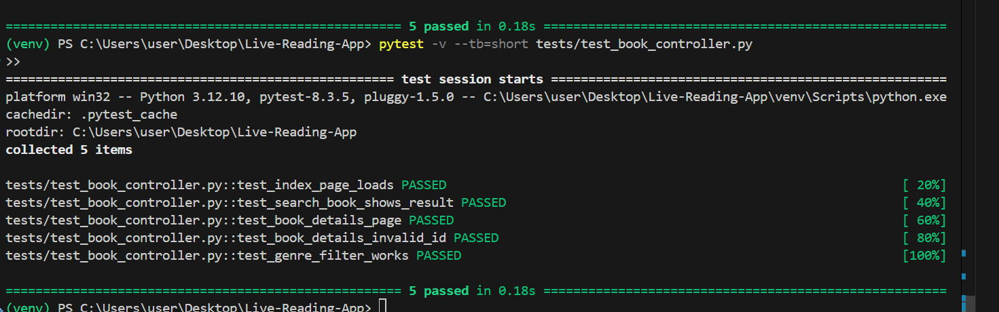

# ✅ Test Report: Authentication, Book, and User Modules

This document summarizes unit test results for the **Authentication**, **Book Management**, and **User Management** modules of the *Live Reading App*, using `pytest`.

---

## 🔐 Module: Authentication

### 🎯 Objectives
- Ensure user registration and login functionality works correctly  
- Prevent duplicate user registrations  
- Block invalid login attempts  
- Restrict access to protected routes for unauthenticated users  
- Verify that logout clears session data

### 📍 Tested Routes

| Route              | Method    | Description                                 |
|--------------------|-----------|---------------------------------------------|
| `/auth/register`   | GET/POST  | Register a new user                         |
| `/auth/login`      | GET/POST  | Log in an existing user                     |
| `/auth/dashboard`  | GET       | Protected route, accessible after login     |
| `/auth/logout`     | GET       | Log out the current user                    |

### ✅ Final Results

| Test Case                         | Result | Description                                     |
|-----------------------------------|--------|-------------------------------------------------|
| `test_register_success`           | ✅     | Registers a user successfully                   |
| `test_register_password_mismatch` | ✅     | Fails when passwords do not match               |
| `test_register_existing_user`     | ✅     | Prevents duplicate email registration           |
| `test_login_success`              | ✅     | Logs in with correct credentials                |
| `test_login_fail`                 | ✅     | Rejects login with incorrect credentials        |
| `test_dashboard_requires_login`   | ✅     | Blocks access to dashboard when not logged in   |
| `test_logout`                     | ✅     | Logs out and redirects to login page            |

📸 Screenshot:  

---

## 📚 Module: Book Management

### 🎯 Objectives
- Ensure homepage loads and displays books  
- Validate search and genre filtering  
- Ensure correct rendering of book detail pages  
- Return proper error for invalid book IDs

### 📍 Tested Routes

| Route                   | Method | Description                                 |
|-------------------------|--------|---------------------------------------------|
| `/`                     | GET    | Homepage with book listings and search      |
| `/book_details/<id>`    | GET    | Shows details of a specific book            |

### ✅ Results

| Test Case                      | Result | Description                                      |
|--------------------------------|--------|--------------------------------------------------|
| `test_index_page_loads`        | ✅     | Homepage loads successfully                      |
| `test_search_book_shows_result`| ✅     | Book search returns correct result               |
| `test_book_details_page`       | ✅     | Shows correct detail for valid book ID           |
| `test_book_details_invalid_id` | ✅     | Returns 404 for invalid/nonexistent book ID      |
| `test_genre_filter_works`      | ✅     | Filters books correctly by selected genre        |

📸 Screenshot:  

---

## 👤 Module: User Management

### 🎯 Objectives
- Ensure admin-only access to user management panel  
- Verify add/delete user features work  
- Test that user info page requires login and displays data properly

### 📍 Tested Routes

| Route                       | Method    | Description                              |
|-----------------------------|-----------|------------------------------------------|
| `/dashboard/users/`         | GET/POST  | Admin user management page               |
| `/dashboard/users/info`     | GET       | Displays info of the logged-in user      |

### ✅ Results

| Test Case                        | Result | Description                                         |
|----------------------------------|--------|-----------------------------------------------------|
| `test_admin_can_access_user_dashboard` | ✅ | Admin can access user dashboard                    |
| `test_non_admin_redirect`             | ✅ | Non-admin users are redirected or denied access     |
| `test_add_user`                       | ✅ | New user can be added successfully                  |
| `test_delete_user`                    | ✅ | User can be deleted correctly                       |
| `test_user_info_requires_login`       | ✅ | User info page requires login                       |
| `test_user_info_page_authenticated`   | ✅ | Authenticated user sees their profile page          |

📸 Screenshot:  

---

## 🧪 Technologies Used

- **Framework:** Flask  
- **Testing Tool:** pytest  
- **Database:** MySQL (`book_store_test`)  
- **Testing Setup:** Flask test client, Pytest fixtures

---

## 🧩 Fixtures Overview

| Fixture        | Purpose                                         |
|----------------|--------------------------------------------------|
| `app`          | Initializes Flask app with test configuration   |
| `client`       | Sends simulated HTTP requests                   |
| `book_factory` | Dynamically generates book instances            |
| `admin_user`   | Creates an admin user for authorization tests   |
| `login_admin`  | Authenticates admin user for dashboard actions  |

---

