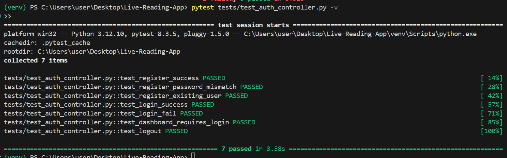
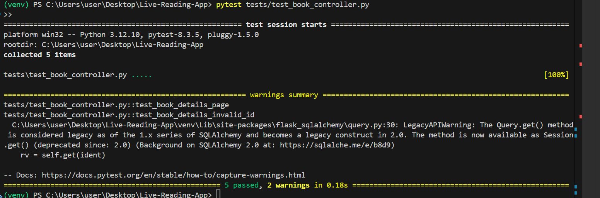

# ✅ Test Report: Authentication and Book Modules

This document summarizes the unit testing process and results for the **Authentication** and **Book Management** modules of the Live Reading App. Tests were executed using `pytest`.

---

## 🔐 Module: Authentication

### 🎯 Objectives

- Verify registration and login functionality
- Block duplicate registrations
- Prevent login with invalid credentials
- Restrict access to protected routes for unauthenticated users
- Ensure logout properly clears session data

### 📍 Tested Routes

| Route              | Method    | Description                                |
|--------------------|-----------|--------------------------------------------|
| `/auth/register`   | GET/POST  | Register a new user                        |
| `/auth/login`      | GET/POST  | Log in an existing user                    |
| `/auth/dashboard`  | GET       | Protected dashboard (requires login)       |
| `/auth/logout`     | GET       | Log out the current user                   |

### ✅ Final Results

| Test Case                         | Result | Description                                        |
|-----------------------------------|--------|----------------------------------------------------|
| `test_register_success`           | ✅     | Successfully registers a user                     |
| `test_register_password_mismatch` | ✅     | Shows error when passwords do not match           |
| `test_register_existing_user`     | ✅     | Blocks duplicate registration                     |
| `test_login_success`              | ✅     | Logs in with correct credentials                  |
| `test_login_fail`                 | ✅     | Rejects incorrect credentials                     |
| `test_dashboard_requires_login`   | ✅     | Prevents dashboard access without login           |
| `test_logout`                     | ✅     | Logs out and redirects to login                   |

📸 Screenshot:  

---

## 📚 Module: Book Management

### 🎯 Objectives

- Ensure homepage, search, and genre filter work
- Test detail page for valid and invalid book IDs

### 📍 Tested Routes

| Route                   | Method | Description                             |
|-------------------------|--------|-----------------------------------------|
| `/`                     | GET    | Book listing and search                 |
| `/book_details/<id>`    | GET    | View individual book details            |

### ✅ Results

| Test Case                      | Result | Description                                   |
|--------------------------------|--------|-----------------------------------------------|
| `test_index_page_loads`        | ✅     | Homepage loads successfully                   |
| `test_search_book_shows_result`| ✅     | Search returns the correct result             |
| `test_book_details_page`       | ✅     | Displays correct book details                 |
| `test_book_details_invalid_id` | ✅     | Returns 404 for non-existent book ID          |
| `test_genre_filter_works`      | ✅     | Filters books based on selected genre         |

📸 Screenshot:  

---

## 🧪 Technologies

- **Framework:** Flask  
- **Testing Tool:** pytest  
- **Database:** MySQL (`book_store_test`)  
- **Environment:** Flask test client, Pytest fixtures

---

## 🧩 Fixtures

| Fixture        | Purpose                                     |
|----------------|---------------------------------------------|
| `app`          | Initializes Flask app with test config      |
| `client`       | Sends simulated HTTP requests               |
| `book_factory` | Dynamically creates test book objects       |

---

## 🔧 Recommendations

- Add tests for CSRF protection and password strength
- Avoid relying solely on flash messages; validate actual content
- Consider adding access control tests for admin routes

---
